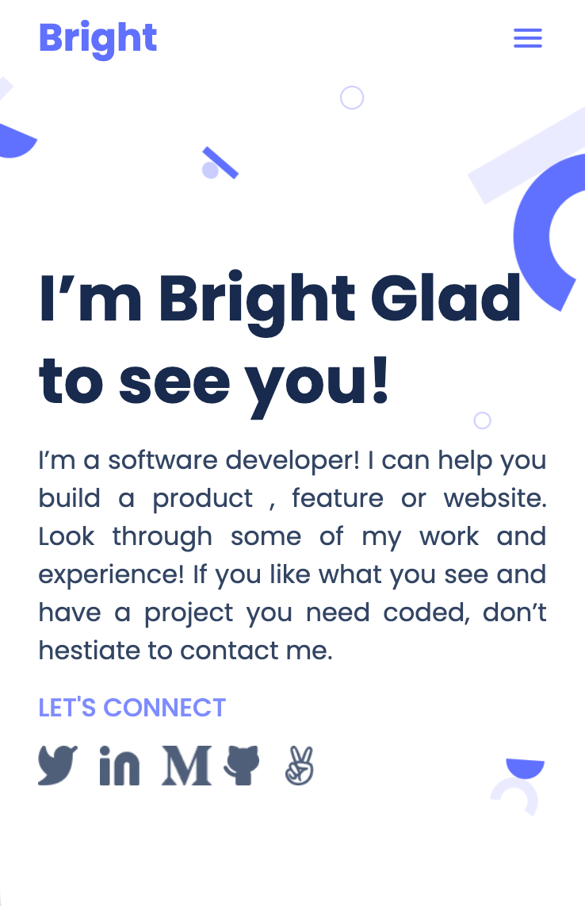

# Portfolio: Bright Kweku Ahiadeke

  
  

> I’m a software developer! I can help you build a product , feature or website. Look through some of my work and experience! If you like what you see and have a project you need coded, don’t hestiate to contact me.

## Built With

- HTML
- CSS
- Linters

## Live Demo

[Live Demo Link](https://kwekubright.github.io/portfolio/)

## Getting Started

To get a local copy up and running follow these simple example steps.

### Usage

- Clone this repository to get started

## Authors

👤 **Bright Ahiadeke**

- GitHub: [@kwekubright](https://github.com/kwekubright)
- Twitter: [@twitterhandle](https://twitter.com/kwekubright_)
- LinkedIn: [LinkedIn](https://linkedin.com/in/kwekubright)

👤 **Aster Alemu**

- GitHub: [@kwekubright](https://github.com/aster-alemu)

👤 **Cecilia Mukima**

- GitHub: [@kwekubright](https://github.com/c3c1l1a)

👤 **Natnael Demelash**

- GitHub: [@kwekubright](https://github.com/NatiDeme)

👤 **Yohannes Dagnachew**

- GitHub: [@kwekubright](https://github.com/yohannesdagnachew)

## 🤝 Contributing

Contributions, issues, and feature requests are welcome!

Feel free to check the [issues page](../../issues/).

## Show your support

Give a ⭐️ if you like this project!

## Acknowledgments

- Hat tip to @microverseinc

## 📝 License

This project is [MIT](./MIT.md) licensed.